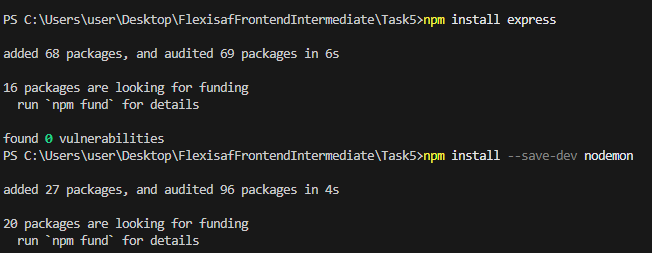

# My Node Task Demo

Simple Express server demonstrating npm usage.

## What I did
- Initialized project with `npm init -y`.
- Installed `express` (dependency) and `nodemon` (dev dependency).
- Added scripts in `package.json`:
  - `npm start` → `node index.js`
  - `npm run dev` → `nodemon index.js`
- Demonstrated installing a package and running scripts.

# To run locally:
npm start

# For development:
npm run dev

My screen shots:

